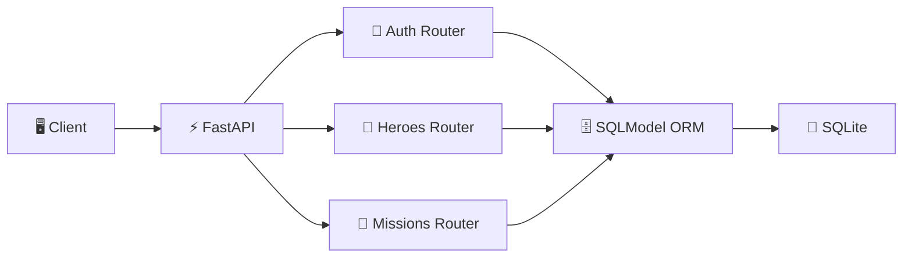

<div align="center">

# 🦸 Secure Hero Missions API


A production-ready REST API for managing heroes and their missions, secured with JWT authentication and role-based access control.

</div>

---

## Features

| Feature | Description |
|---|---|
| 🔐 JWT Authentication | Secure token-based auth with bcrypt password hashing |
| 👑 Role-Based Access | Admin vs regular user permission tiers |
| 🦸 Hero Management | Full CRUD with partial updates |
| 🎯 Mission Tracking | Assign missions to heroes, track completion |
| 🔗 Business Rules | Enforced constraints (e.g. no delete with active missions) |
| 📖 Auto Docs | Interactive Swagger UI at `/docs` |

---

## Architecture



---

## Quick Start

```bash
git clone https://github.com/GiorgosPanagopoulos/secure-hero-missions-api.git
cd secure-hero-missions-api/hero_api
pip install -r requirements.txt
uvicorn app.main:app --reload
```

API docs available at: `http://localhost:8000/docs`

---

## API Endpoints

| Method | Endpoint | Access | Description |
|---|---|---|---|
| `POST` | `/auth/register` | Public | Register a new user |
| `POST` | `/auth/login` | Public | Login and receive JWT token |
| `GET` | `/auth/me` | Authenticated | Get current user info |
| `POST` | `/heroes/` | Authenticated | Create a new hero |
| `GET` | `/heroes/` | Public | List all heroes |
| `GET` | `/heroes/{id}` | Public | Get hero by ID |
| `PATCH` | `/heroes/{id}` | Authenticated | Partial update hero |
| `DELETE` | `/heroes/{id}` | Admin only | Delete hero (no active missions) |
| `POST` | `/missions/` | Authenticated | Create a mission for a hero |
| `GET` | `/missions/` | Public | List all missions |
| `GET` | `/missions/{id}` | Public | Get mission by ID |
| `PATCH` | `/missions/{id}` | Authenticated | Partial update mission |
| `DELETE` | `/missions/{id}` | Admin only | Delete mission |

---

## Testing

```bash
pytest tests/ -v
```

All 7 tests cover registration, login, token auth, role enforcement, and business rules.

---

## 📸 Screenshots

### Swagger UI Overview


### Missions Endpoints


### Register — 201 Created


### Tests Passed


---

## Future Improvements

- 🐳 **Docker** — containerize for one-command deployment
- 🔄 **Alembic migrations** — versioned schema evolution
- 🚦 **Rate limiting** — protect endpoints from abuse
- 🔑 **Role expansion** — granular permissions per resource type
- 📊 **Observability** — structured logging and request tracing

---

<div align="center">
<i>I build things I'd trust with something that matters.</i>
<br><br>
Built by <b>Georgios Panagopoulos</b>
<br>
<a href="https://github.com/GiorgosPanagopoulos"></a>
<a href="https://linkedin.com/in/gpanagopoulos"></a>
<br><br>
☕ Powered by mass amounts of caffeine & mass amounts of curiosity.
</div>
